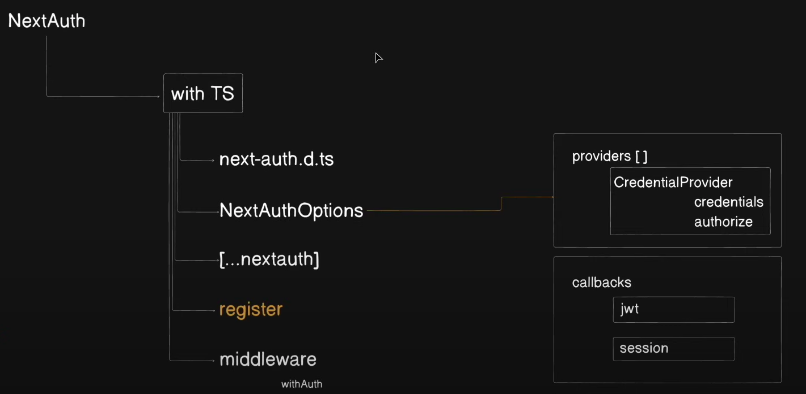
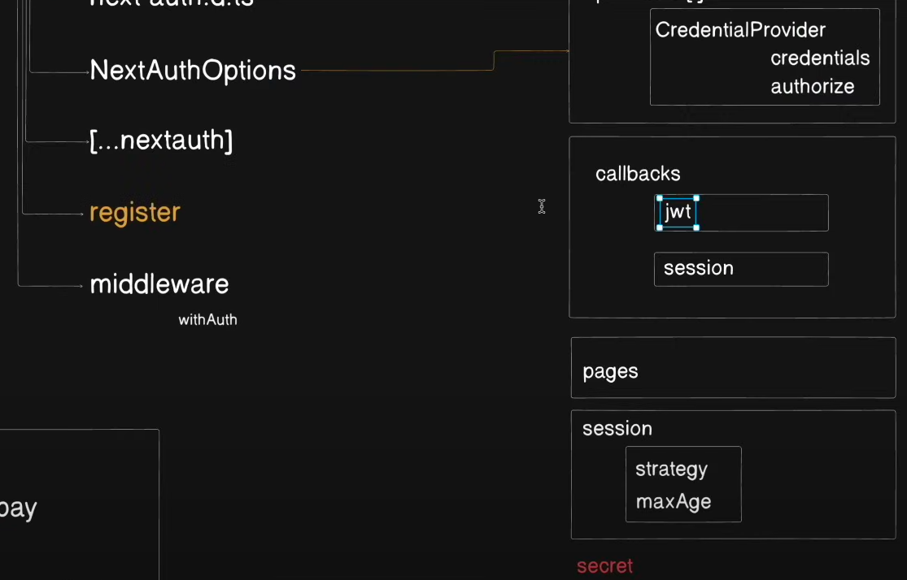

Next JS hamesha edge pe chalta hai.(edge is the location in the all around world jha hamari next application run hoti hai)

Backend file always should be route and frontend file should be page.

1️⃣ bufferCommands: true  
➡️ Default: true
This allows mongoose to buffer database operations before the connection is established.

If bufferCommands: true, Mongoose stores the operations (like find(), save(), update()) in a queue until the   connection is ready.
If false, Mongoose will throw an error if you try to run a query before the connection is established.

2️⃣ maxPoolSize: 10
This sets the maximum number of connections that can be opened in the MongoDB connection pool.

A connection pool allows multiple requests to share a limited number of DB connections, reducing latency.
If the pool is full, new requests must wait until a connection is free.

4️⃣ Pre-save Hook for Password Hashing
- Runs before saving (pre("save")).
- Checks if the password is modified using this.isModified("password"):
- If true, hashes the password using bcrypt.hash().
- If false, moves to the next middleware.

2️⃣ Why Do We Use a Pre-save Hook?
- A pre-save hook (userSchema.pre("save")) is a middleware function that runs before saving a document in MongoDB.

✅ Why is it Useful?
- Automatic Hashing: It ensures that passwords are always hashed before being stored.
- Security: Prevents accidental storage of plain-text passwords.
- Avoids Rehashing: Runs only if the password is modified

5️⃣ Preventing Model Re-declaration
Why do we use models?.User || model("User", userSchema)?
- In Next.js (or during hot reloads), Mongoose recompiles models on every request.
- models?.User checks if the model is already defined.
- If it exists, it reuses the existing model.
- If it does not exist, it creates a new one using model("User", userSchema).
Why is this important?
- Without this check, Mongoose might throw an OverwritingModelError when hot-reloading.

3️⃣ What is Hot Reloading?
- Hot Reloading allows your code to update without restarting the server.

✅ How It Works?
- When you save a file, only the changed parts are reloaded in memory.
- This prevents losing app state and restarting the server.
Why Do We Need models?.User || model("User", userSchema)?
- In Next.js, due to hot reloading, Mongoose recompiles models on every request.
- Without checking models?.User, Mongoose would try to create a new model every time, leading to an  OverwritingModelError.

In next-auth.d.ts file -->   
✅ user: The object storing authenticated user details.  
✅ DefaultSession: The default structure of session in NextAuth.  
✅ Extending DefaultSession["user"] lets us add custom properties like id.

Middleware:  
🔹 What this middleware does
Protects private pages by requiring authentication.
Allows public pages (like /, /api/videos, /login, and /register) without authentication.
Ensures users cannot access protected routes unless they are logged in.  
Excludes static assets from authentication checks.  
🔹 How it works  
Checks if the requested path is public (e.g., /, /login, /register, /api/videos).
If yes → Allow access (return true).
For all other pages, check if a token (authenticated user) exists.
If yes → Allow access (return !!token).
If no → Block access.  
✅ This middleware ensures that:
Auth routes work normally.
Public pages stay accessible.
Private pages are protected.
Static files are not affected.

# Folder and File Structure
1. lib -> db.ts
2. For database connection we required a third party library (ORS) and here we use mongoose.
3. Now we required that jo hamara node enviroment hamari next js application ko run kar rha hai usse koi mongodb ka connection mil jaaye jo ki mongoose karayega but it is not present in the global object so for that we create a global type file -->types.d.ts
4. SO till now we have created a connection with the database and now we will create a schema or models for our database. And in typescript we have to to define the type of any model which is called as **interface**.
5. models-->
User.ts(For hashing the password we use bcrypt library-->npm i bcryptjs)
Video.ts
### Backend(in api folder)
- All backend files will be in the api folder.
6. Authentication-->        
- src-->app-->api-->auth-->register-->route.ts (API route-->/api/auth/register)
### Authentication
By using NextAuth(npm i next-auth)  
All files for implementing next-auth-->

1. next-auth.d.ts
2. lib-->options.ts 
  - First we define the array of providers.
  - Callback
  - Session    
  So we use strategy as jwt bcs otherwise it will give default session which will not include the jwt token. So now we have access of jwt token. And we will store it in user object as id. Now this user is available everywhere. SO we will use this user in jwt and extract the id from it and return token.
3. [...nextauth]-->route.ts
4. middleware.ts --> In nextjs project this file always created in root directory.

### ImageKit
https://imagekit.io/docs/integration/nextjs#setup-imagekit-next.js-sdk
npm i imagekit
1. Add config code 
2. api-->imagekit-auth-->route.ts

components-->
1. Provider.tsx
2. FileUpload.tsx

Now we go to the layout.tsx and wrap up the children with the provider. Now providers are available in our whole application-->layout.tsx

Now there is one route left which is Video --> api/videos/route.ts

## Frontend
components->Header.tsx
app-->register-->page.tsx
app-->login-->page.tsx

For centralized api calls of frontend we create a file in lib-->api-client.ts

components-->
VideoComponents
VideoFeed
Notification

app-->upload-->page.tsx

------------------------------------------------------------------------------

Front page-->
page.tsx-->VideoFeed{videos}-->VideoComponent{key,video}

Video upload-->
app-->upload-->page.tsx-->VideoUploadForm.tsx-->FileUpload.tsx

-------------------------------------------------------------------------------
# Project Structure
my-app/                                   # Root directory
├── lib/                                   # Utility functions & configs
│   ├── api-client.ts
│   ├── db.ts
│   └── options.ts
│
├── models/                                # MongoDB models
│   ├── User.ts
│   └── Video.ts
│
├── node_modules/                          # Node dependencies
│
├── public/                                # Static assets
│
├── src/                                   # Source code
│   └── app/                               # Next.js app directory
│       ├── api/                           # API routes
│       │   ├── auth/
│       │   │   ├── [...nextauth]/route.ts   # NextAuth API route
│       │   │   └── register/route.ts        # Registration API route
│       │   ├── imagekit-auth/route.ts      # ImageKit authentication API route
│       │   └── videos/route.ts             # Videos API route
│       │
│       ├── components/                     # Reusable components
│       │   ├── Header.tsx
│       │   ├── FileUpload.tsx
│       │   ├── VideoFeed.tsx
│       │   ├── VideoComponent.tsx
│       │   ├── Notification.tsx
│       │   ├── Provider.tsx
│       │   └── VideoUploadForm.tsx
│       │
│       ├── login/page.tsx                  # Login page
│       ├── register/page.tsx               # Registration page
│       └── upload/page.tsx                 # Video upload page
│
├── .env                                   # Environment variables
├── .gitignore                             # Git ignore file
├── daisyui.d.ts                           # DaisyUI types
├── eslint.config.mjs                      # ESLint configuration
├── middleware.ts                          # Middleware for Next.js
├── next-auth.d.ts                         # NextAuth types
├── next-env.d.ts                          # Next.js environment types
├── next.config.ts                         # Next.js config
├── Notes.md                               # Notes/documentation
├── package-lock.json                      # Package lock file
├── package.json                           # Project metadata and dependencies
├── postcss.config.mjs                     # PostCSS configuration
├── README.md                              # Project overview
├── tailwind.config.ts                     # Tailwind CSS configuration
├── tsconfig.json                          # TypeScript config
└── types.d.ts                             # Global types
